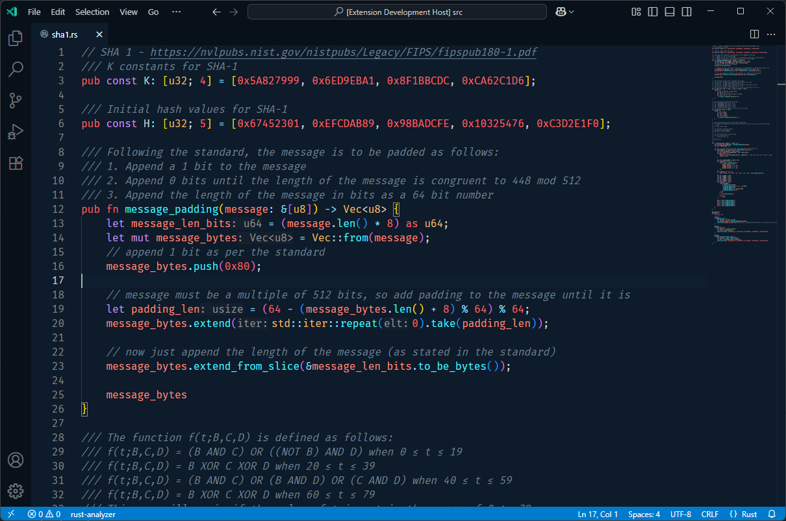

# Whale Theme

A ocean based theme for Visual Studio Code! I hope that you like it, if you have any issues, please open an issue on [Github](https://github.com/ImmutableVariable/Whale-Theme)

You can install this extension at [Visual Studio Code](https://marketplace.visualstudio.com/items?itemName=ImmutableVariable.whale-theme)!

For running this locally, see [vsc-extension-quickstart.md](./vsc-extension-quickstart.md)

## Style Guide
The following is a style guide based on the colors in the json file. If a element is not here, it is just the default color from vscode dark.

### Main Colors

| Section | Element | Description | Color | Style | 
| --- | --- | --- | --- | --- |
| Editor | Background | The background color of the editor area | #0d1b2a | - |
| Editor | Foreground | The foreground color of the editor area | #cfd2d5 | - |
| Editor | Current Line Background/Border | The background of the current line | #0e1e2e | - |
| Editor | Selection Background | The background of the selected text | #13293f | - |
| Sidebar | Background | A slightly darker color of the main area for contrast, but not as dark as the actity bar. This has the "Explorer" menu | #0a1622 | - |
| Sidebar | Foreground | All the text should be this color | #cfd2d5 | - |
| Sidebar | Section Header | All of the section headers should be this color | #0e1e2e | - |
| Sidebar | List On Hover | On hover, all elements (such as files) should be changed to this darker color | #08111a | - |
| Sidebar | List elements background | The elements within the file list should remain constant, as in the color does not change | #0a1622 | - |
| Sidebar | List elements foreground | Same | #cfd2d5 | - |
| Activity Bar | Background | This is the far left bar, it should be darker than the explorer list  | #08111a | - |
| Activity Bar | Badge Background | This is the color of the badge  | #007acc | - |
| Title Bar | Background | Same color as the activity bar, it should include the top bar | #08111a | - |
| Title Bar | Active Background | Same as before, this makes sure that when you tab out, it does not change colors | #08111a | - |
| Tabs | Background | The file tabs (below the title bar) should be this color | #08111a | - |
| Tabs | Inactive Background | Same as before, this makes sure that when you tab out, it does not change colors | #08111a | - |
| Tabs | Inactive Foreground | The color should be the same as comments for the text | #708090 | - |
| Tabs | Border | The divider between tabs will be this color | #08111a | - |
| Tabs | Active Elements | Copy the same color as the editor background | #0d1b2a | - |
| Input	| Background | Background for input elements like the search bar | #08111a	| - |
| Input	| Border | Border color for input elements | #08111a	|-|
| Editor Widget	| Background | Background of editor widgets like IntelliSense popups | #0e1e2e |-|
| Scrollbar | Background | Background of the scrollbar | #13293f |-|
| Scrollbar | Active Background | Same as before, this makes sure that when you tab out, it does not change colors | #13293f | - |
| Scrollbar | Hover Background | When you hover, it should be slightly lighter | #193450 | - |
| Menu | Background | The background of the menus such as the file menu at the top, etc| #13293f | - |
| Menu | Foreground | Classic text | #cfd2d5 | - |

### Tokens

| Element | Description | Color | Style |
|--------|-------------|--------|-------|
| Comment | comment, punctuation.definition.comment | #708090 | *italic* |
| Variables | variable, string constant.other.placeholder | #fd8a78 | - |
| Colors | constant.other.color | #cfd2d5 | - |
| Invalid | invalid, invalid.illegal | #FF5370 | - |
| Keyword, Storage | keyword, storage.type, storage.modifier | #C792EA | - |
| Operators | keyword.operator, keyowrd.operator.new, keyword.operator.arithmetic, keyword.operator.assignment, keyword.operator.comparison, keyword.operator.logical, keyword.operator.bitwise | #8ed4f0 | - |
| Punctuation | punctuation, punctuation.definition.tag, punctuation.separator.inheritance.php, punctuation.definition.tag.html, punctuation.definition.tag.begin.html, punctuation.definition.tag.end.html, punctuation.section.embedded | #cfd2d5 | - |
| Control Keywords | keyword.control, keyword.other.template, keyword.other.substitution | #ff9cac | - |
| Tag | entity.name.tag, meta.tag.sgml, markup.deleted.git_gutter | #f07178 | - |
| Function, Special Method | entity.name.function, meta.function-call, variable.function, support.function, keyword.other.special-method | #39ccda | - |
| Block Level Variables | meta.block variable.other | #f07178 | - |
| Other Variable, String Link | support.other.variable, string.other.link | #f07178 | - |
| Number, Constant, Function Argument, Tag Attribute, Embedded | constant.numeric, constant.language, support.constant, constant.character, constant.escape, variable.parameter, keyword.other.unit, keyword.other | #fd6161 | - |
| String, Symbols, Inherited Class, Markup Heading, String Quote Symbols | string, constant.other.symbol, constant.other.key, entity.other.inherited-class, markup.heading, markup.inserted.git_gutter, meta.group.braces.curly constant.other.object.key.js string.unquoted.label.js, punctuation.definition.string.begin, punctuation.definition.string.end, string.quoted.single punctuation.definition.string, string.quoted.double punctuation.definition.string, string.template punctuation.definition.string | #9ce88d | - |
| Class, Support | entity.name, support.type, support.class, support.other.namespace.use.php, meta.use.php, support.other.namespace.php, markup.changed.git_gutter, support.type.sys-types | #ecbc61 | - |
| Entity Types | support.type | #a8c1ca | - |

**THERE ARE MORE TOKENS, THEY ARE THE DEFAULTS. Feel free to choose whatever you'd like for them**